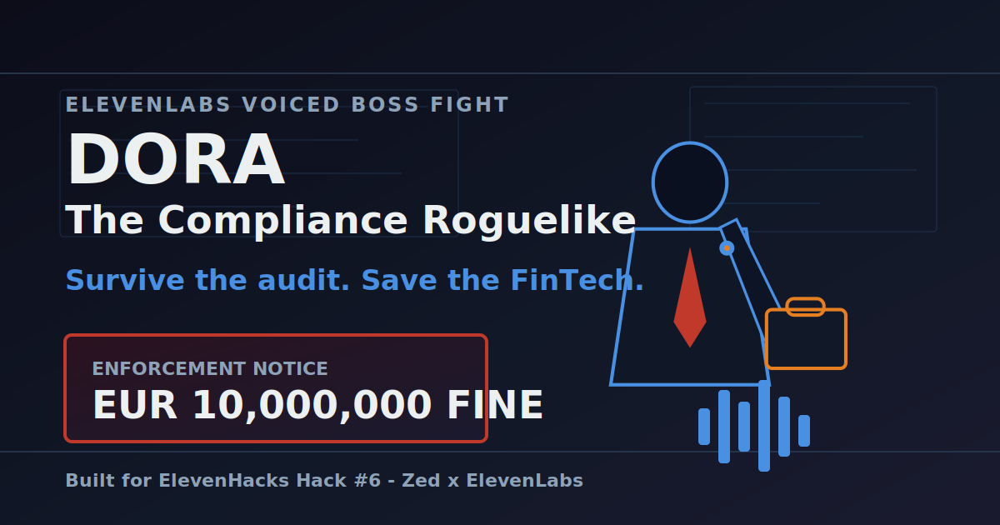

# DORA: The Compliance Roguelike



Survive the audit. Save the FinTech.

A browser-based card roguelike where you play as a FinTech CTO defending against EU regulatory audit findings. The Regulator is designed around pre-generated ElevenLabs TTS, adaptive music, and audit findings that escalate into a Grand Regulator boss phase.

## Live Demo

https://dora-roguelike.vercel.app

## Built With

- Vanilla TypeScript
- Vite
- Canvas API
- ElevenLabs-ready audio manifest
- Zed-assisted feature delivery workflow

## Local Development

```bash
npm install
npm run dev
```

Open the Vite URL and tap once to unlock audio. Use `VITE_DEBUG_SKIP_AUDIO=true` only when you intentionally want to bypass missing local audio files.

## Validation

```bash
npm test
npm run build
```

## QA Shortcuts

- `N`: next round
- `B`: force boss round
- `V`: force victory
- `F`: force defeat
- `Q/W/E/R/T`: damage compliance indicators
- `A`: restore the lowest indicator

For production video capture, append `?recording=1` to the live demo URL to enable the same shortcuts without changing the normal judge-facing URL.

## ElevenLabs Integration

The game uses stable audio ids for:

- Standard Regulator dialogue
- Grand Regulator boss dialogue
- Menu, calm, tense, boss, victory, and defeat music
- Card play, block, damage, critical damage, and boss entrance SFX

During development, `VITE_DEBUG_SKIP_AUDIO=true` lets the game exercise all audio calls without requiring generated files. Production audio is enabled by default when the variable is unset.

To generate audio locally, add `ELEVENLABS_API_KEY` to `.env`, then run:

```bash
npm run generate:audio -- --kind=tts
npm run generate:audio -- --kind=sfx
npm run generate:audio -- --kind=music
```

Generated MP3 files are written to `public/audio/` and preloaded before the tap-to-start screen.
